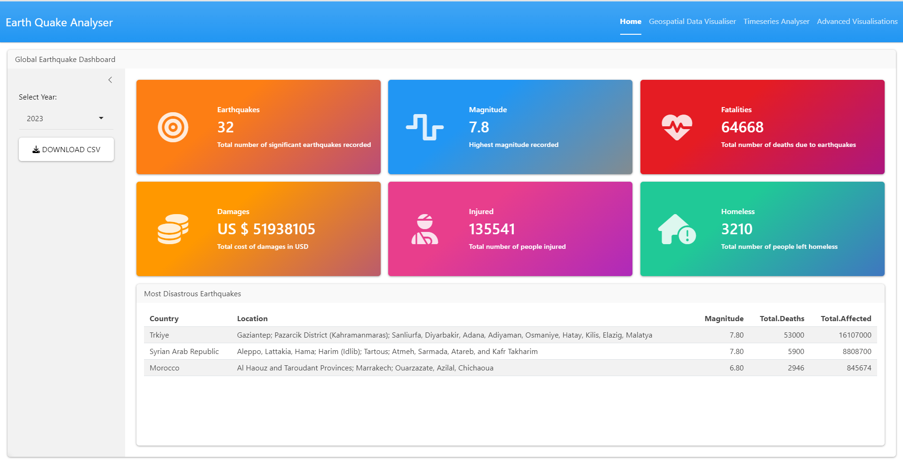
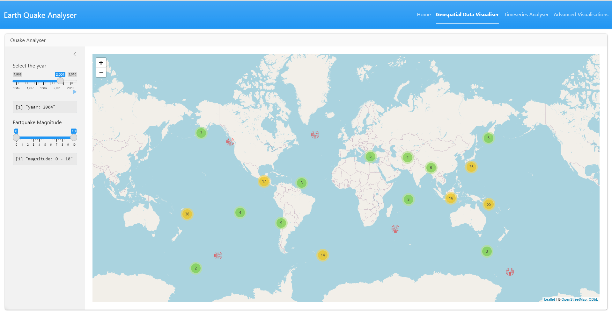
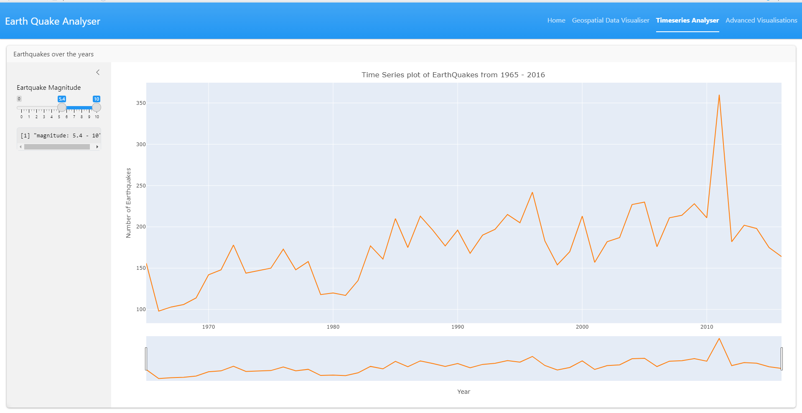

# Earthquake Analyzer

This Shiny app provides an interactive platform to explore global earthquake data. The app includes several functionalities such as data visualization, geospatial mapping, and time-series analysis.

## Table of Contents

- [Introduction](#introduction)
- [Features](#features)
- [Data](#data)
- [Installation](#installation)
- [How to Run](#how-to-run)
- [Usage](#usage)
- [Acknowledgements](#acknowledgements)

## Introduction

The **Earthquake Analyzer** is an interactive dashboard that visualizes earthquake data across various dimensions such as:

- Number of earthquakes recorded
- Magnitude and fatalities
- Damages and affected populations

It also provides a time-series view and geospatial visualization of earthquakes across different regions. The app allows users to select specific years and earthquake magnitudes for detailed analysis.

## Features

- **Global Earthquake Dashboard**: Displays key metrics such as the number of earthquakes, highest magnitude, fatalities, damages, injuries, and more for the selected year.
- **Geospatial Data Visualizer**: A world map showing earthquake occurrences based on magnitude and location.
- **Timeseries Analyzer**: Time-series analysis of earthquake events from 1965 to 2016.
- **Downloadable Data**: Users can download earthquake data in CSV format.

## Data

The application uses earthquake data, including fields such as:

- **Country**: The country where the earthquake occurred.
- **Location**: The specific region or city affected.
- **Magnitude**: The magnitude of the earthquake.
- **Total.Deaths**: The number of deaths caused by the earthquake.
- **Total.Affected**: The total number of people affected by the earthquake.

## Installation

1. Clone the repository to your local machine:

   ```bash
   git clone https://github.com/ajulthomas/earth-quake-analytics.git
   ```

2. Install the required R packages:

   ```R
   install.packages(c("shiny", "leaflet", "ggplot2", "dplyr"))
   ```

3. Make sure you have the required data files in the `data/` directory.

## How to Run

To run the app locally, use the following steps:

1. Open RStudio or any R environment.
2. Set the working directory to the folder containing the `app.R` file.
3. Run the following command in the R console:
   ```R
   shiny::runApp()
   ```

## Usage

- **Global Earthquake Dashboard**: Select a year from the dropdown to view data related to that year.
- **Geospatial Data Visualizer**: Use the slider to filter earthquakes by magnitude and year. Earthquake locations are plotted on an interactive world map.
- **Timeseries Analyzer**: Filter the earthquakes by magnitude using the slider to see a time-series plot of earthquakes over the years.







## Acknowledgements

- The earthquake data used in this app is publicly available and has been processed for the purposes of this analysis.
- This project was built using the R Shiny framework for interactive web applications.
